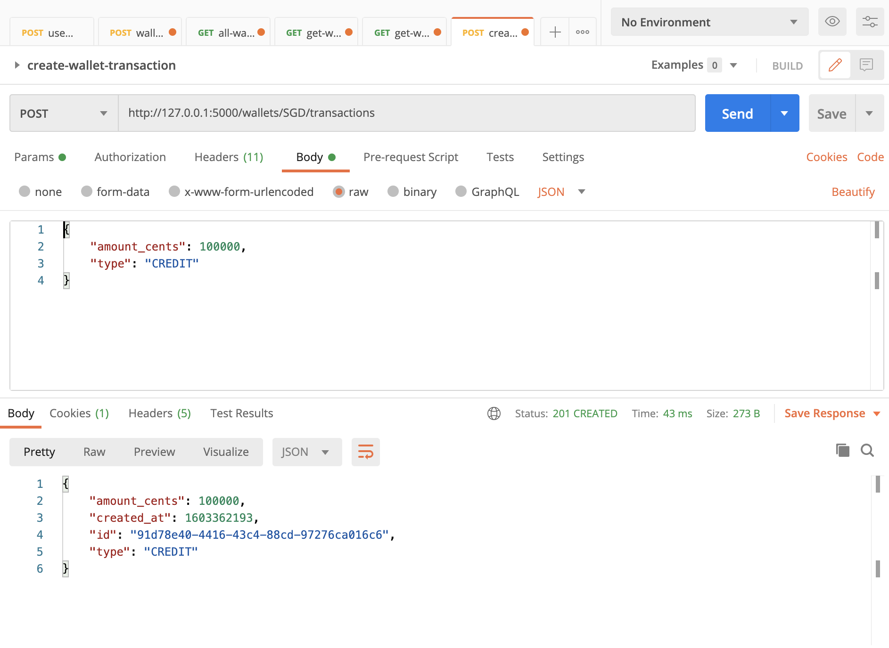

# Kophinos

## About
Kophinos is a greek word which is used for box and later used for safe box. The aim of this application is to provide a
mobile wallet as a service.

### Assumptions and understanding of the problem

- This project was developed in a machine using macOS Catalina
- These instructions assume you are working on a unix based system.
- Since the API required is too small, the application will be done with Flask
- A user can only control their own wallets
- The receiver user is specified by email (seems the most intuitive way to find somebody to send
money to), even though I would add the possibility to specify phone or other details, but leaving
this out of scope.
- To really focus the code on the problem I didn't add boiler plate code to add swagger for the
api documentation, but I would add the API client documentation on top of this. On the demo section you can find all the endpoints and how do they work.
- To reduce scope and because there are no explicit requirements, a few things were simplified:
  - PPI data like customer information are store in the DB with the rest of the data.
  - Even though I'm using tokens, I have not introduced any mechanism for expiration of the token (more security)
  - There is no end to end encryption on the communication.
  - I allow a user's wallet to be in a negative balance. (This can be changed easily)
  - You can create a user through the API, but the functionality is pretty basic. You won't be able to do more things like patching or reading information from the user.
  - Error messages in the API are really basic. No presenters

### Requirements

Make sure that you have the following installed on your machine:

- Python 3.8.5 (version in `.python-version` file)
- I strongly recommend that you setup a virtual environment for this project
- Postgres is used as DB, in case you are using MacOS > 10, make sure that you have the correct openssl flags exported in your terminal, otherwise you will run into trouble with the binaries for `psycopg2`. For example:
```bash
export CPPFLAGS="-I/usr/local/opt/openssl@1.1/include"
export LDFLAGS="-L/usr/local/opt/openssl@1.1/lib"
```
- Docker will be running all dependencies from the project including the DB. For Mac user please read [documentation](https://docs.docker.com/docker-for-mac/)

#### Installing python

You can use your system python, but if you want to use multiple python versions on your machine, use [pyenv](https://github.com/pyenv/pyenv). If you are using it, the python version will be detected automatically inside the project's folder.

#### Installing dependencies

Like I said before, I strongly recommend using a virtual environment for this project, for this run the following:

```bash
make virtualenv
```

Activate the virtual environment
```bash
. venv/bin/activate
```

Install all the dependencies:
```bash
make install
```

If you want to exit the virtual env:
```bash
deactivate
```

#### Postgres

##### Running the DB
Like I mentioned before the DB will be running in a docker container so the application doesn't need to interact with your system. If you have postgres running locally make sure you change the port in the docker container. Here we will assume that you don't need to:

```bash
docker run --name kophinos_test -e POSTGRES_USER=kophinos -e POSTGRES_PASSWORD=kophinos -e POSTGRES_DB=kophinos_test -p 5434:5432 -d postgres:12.1
```

Also I run 2 different docker container at the same time, one for test and one for development. Make sure all your envs are point accordingly
##### Migrate

```bash
make migrate
```

For rollback:
```bash
make rollback
```

#### Running tests

Is really important at this point that you have a DB running so you can point the test to. The previous point gives you an example of how to do it. Now you need to set up your testing environment.

##### Setup .test.env

Modify the values accordingly
```bash
cp .sample.env .test.env
```

Run migrations on testing environment
```bash
APP_ENV=test make migrate
```

Once this is done and all env variables are changed to the correct values. Run:
```bash
make test
```

If you have reached this point without errors, congratulations you can start the application.


#### Running the app

Modify the values accordingly
```bash
cp .sample.env .dev.env
```

For running the app:
```bash
python app.py api
```
Anything else will show you an error message.

## Demo

The API has available the following endpoints, running locally:


- **Create user**

 [POST] http://127.0.0.1:5000/users


- **Login**

 [POST] http://127.0.0.1:5000/login


**NOTE:** From this point you need to be authenticated. Add user token to your headers


- **Logout**

[GET] http://127.0.0.1:5000/logout


- **Create wallet**

[POST] http://127.0.0.1:5000/wallets


- **Read all wallets**

[GET] http://127.0.0.1:5000/users/wallets


- **Read specific wallet**

[GET] http://127.0.0.1:5000/wallets/SGD


- **Read specific wallet transactions**

[GET] http://127.0.0.1:5000/wallets/SGD/transactions


- **Create specific wallet transaction**

[POST] http://127.0.0.1:5000/wallets/SGD/transactions


- **Create specific wallet transfer**

[POST] http://127.0.0.1:5000/wallets/SGD/transfers


I invite you you hit all the endpoints after you have made an operation, so you can see
how balances, wallets and transactions get affected.

Make sure you are authenticated otherwise you will see the following message:


Also remove some of the fields you can see in the pictures, or change the currency and
you will see different error messages.

## Missings

Aside from things what I mentioned before, I would add the following things:

- Dockerise the app
- Deployment process ( It could be something like kubernetes and is compatible with docker )
- Alerting ( it can be as simple as adding honeybadger or maybe a more complex system with oncall support )
- Monitoring ( Here I would mainly divide what is engineer focused and business focused ). Based on
what I previously said, I would make sure we have the dashboards to understand what is going on.

Also as a good feature I would add the possibility to make transfers between accounts no matter
the currency used, and make the application make the currency change on real time based on the
market value.
